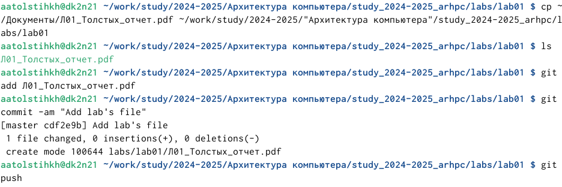

---
## Front matter
title: "Отчёт по лабораторной работе №2"
subtitle: "Дисциплина: Архитектура компьютера"
author: "Толстых Александра Андреевна"

## Generic otions
lang: ru-RU
toc-title: "Содержание"

## Bibliography
bibliography: bib/cite.bib
csl: pandoc/csl/gost-r-7-0-5-2008-numeric.csl

## Pdf output format
toc: true # Table of contents
toc-depth: 2
lof: true # List of figures
lot: true # List of tables
fontsize: 12pt
linestretch: 1.5
papersize: a4
documentclass: scrreprt
## I18n polyglossia
polyglossia-lang:
  name: russian
  options:
	- spelling=modern
	- babelshorthands=true
polyglossia-otherlangs:
  name: english
## I18n babel
babel-lang: russian
babel-otherlangs: english
## Fonts
mainfont: IBM Plex Serif
romanfont: IBM Plex Serif
sansfont: IBM Plex Sans
monofont: IBM Plex Mono
mathfont: STIX Two Math
mainfontoptions: Ligatures=Common,Ligatures=TeX,Scale=0.94
romanfontoptions: Ligatures=Common,Ligatures=TeX,Scale=0.94
sansfontoptions: Ligatures=Common,Ligatures=TeX,Scale=MatchLowercase,Scale=0.94
monofontoptions: Scale=MatchLowercase,Scale=0.94,FakeStretch=0.9
mathfontoptions:
## Biblatex
biblatex: true
biblio-style: "gost-numeric"
biblatexoptions:
  - parentracker=true
  - backend=biber
  - hyperref=auto
  - language=auto
  - autolang=other*
  - citestyle=gost-numeric
## Pandoc-crossref LaTeX customization
figureTitle: "Рис."
tableTitle: "Таблица"
listingTitle: "Листинг"
lofTitle: "Список иллюстраций"
lotTitle: "Список таблиц"
lolTitle: "Листинги"
## Misc options
indent: true
header-includes:
  - \usepackage{indentfirst}
  - \usepackage{float} # keep figures where there are in the text
  - \floatplacement{figure}{H} # keep figures where there are in the text
---

# Цель работы

Целью работы является изучить идеологию и применение средств контроля
версий. Приобрести практические навыки по работе с системой git. 

# Задание

1. Настройка github
2. Базовая настройка git
3. Создание SSH ключа
4. Создание рабочего пространства и репозитория курса на основе шаблона
5. Создание репозитория курса на основе шаблона
6. Настройка каталога курса
7. Задание для самостоятельной работы

# Теоретическое введение

Система контроля версий Git представляет собой набор программ командной строки. Доступ к ним можно получить из терминала посредством ввода команды git с различными опциями. Благодаря тому, что Git является распределённой системой контроля версий, резервную копию локального хранилища можно сделать простым копированием или архивацией.

Приведем таблицу снаиболее часто используемыми командами git в таблице №1.

| Команда                                  |  Описание                                                                                                          |
|--------------|----------------------------------------------------------------------------------------------------------------------------|
| `git init`          | Создание основного дерева репозитория                                                                               |
| `git pull`      | Получение обновлений (изменений) текущего дерева из центрального репозитория     |
| `git push`       | Отправка всех произведенных изменений локального дерева в центральный репозиторий                                           |
| `git status`      | Просмотр списка измененных файлов в текущей директории |
| `git diff`     | Просмотр текущих изменений                                                                                   |
| `gitt add .`      | Добавить все изменённые или созданные файлы или каталоги                                                                                   |
| `git add имена_файлов`       | Добавить конкретные изменённые или созданные файлы или каталоги                                                                                                            |
| `git rm имена_файлов`       | Удалить файл и/или каталог из индекса репозитория (при этом файл или каталог остаётся в локальной директории)                                                                                 |
| `git commit -am 'Описание коммита'`       | Сохранить все добавленные изменения и все изменённые файлы                                                                                 |
| `git checkout -b имя_ветки`       | Создание новой ветки, базирующейся на текущей                                                                                 |
| `git checkout имя_ветки`       | Переключение на некоторую ветку (при переключении на ветку, которой ещё нет в локальном репозитории, она будет создана и связана с удалённой)                                                                                 |
| `git push origin имя_ветки`       | Отправка изменений конкретной ветки в центральный репозиторий                                                                                 |
| `git merge --no-ff имя_ветки`       | Слияние ветки с текущим деревом                                                                                 |
| `git branch -d имя_ветки`       | Удаление локальной уже слитой с основным деревом ветки                                                                                 |
| `git branch -D имя_ветки`       | Принудительное удаление локальной ветки                                                                                 |
| `git push origin :имя_ветки`       | Удаление ветки с центрального репозитория                                                                                 |

# Выполнение лабораторной работы

## Настройка github

Сначала мы создаем учетную запись на сайте github и заполняем основные данные. Поскольку сайт не позволял регистрировать учетную запись с использованием корпоративной почты (рис. [-@fig:001]), я зашла на сайт используя свою уже существующую учетную запись на github, созданную ранее на личную почту (рис. [-@fig:002]).

{#fig:001 width=70%}

{#fig:002 width=70%}

## Базовая настройка git

Открываю терминал и делаю предварительную конфигурацию git (рис. [-@fig:003]). Ввожу команды «git config --global user.name» и «git config --global user.email», указывая данные от своего аккаунта. При помощи команды «git config --global core.quotepath false» настраиваю utf-8 в выводе сообщений git для их корректного отображения.
Далее задаю имя начальной ветки «master», а также параметры «autocrlf» (параметр необходим для настройки конвертации crlf в lf) и «safecrlf» (параметр необходим для проверки преобразования на обратимость).

{#fig:003 width=70%}

## Создание SSH-ключа

Для последующей идентификации пользователя на сервере репозиториев необходимо сгенерировать приватный и открытый ключи. Ввожу команду «sshkeygen -C» указывая как аргументы свои данные: имя, фамилию и почту (рис. [-@fig:004]). Ключи сохраняются в каталоге ~/.ssh/.

{#fig:004 width=70%}

Копируем ключ в буфер обмена при помощи команды «cat ~/.ssh/id_rsa.pub | xclip -sel clip» (рис. [-@fig:005]). 

{#fig:005 width=70%}

Вставляю скопированный ключ в поле на сайте, чтобы добавить его (рис. [-@fig:006]).

{#fig:006 width=70%}

## Создание рабочего пространства и репозитория курса на основе шаблона

При выполнении лабораторных работ следует придерживаться структуры рабочего пространства, поэтому при помощи команды mkdir с аргументом -p создаю нужную вложенную последовательность каталогов (рис. [-@fig:007]).

{#fig:007 width=70%}

## Создание репозитория курса на основе шаблона

Репозиторий на основе шаблона можно создать через web-интерфейс github. Для этого перехожу на станицу репозитория с шаблоном курса по ссылке, указанной в лабораторной работе. Далее использую кнопку «Use this template» (рис. [-@fig:008]). 

{#fig:008 width=70%}

В открывшемся окне задаю имя репозитория «study_2024-2025_arhpc» и создаю его при помощи кнопки «Create repository from template» (рис. [-@fig:009]).

{#fig:009 width=70%}

Через терминал перехожу в созданный каталог курса при помощи команды cd. Клонирую данный репозиторий при помощи команды «git clone –recursive git@github.com:/llllisonok/study_2024-2025_arhpc.git» (рис. [-@fig:010]).

{#fig:010 width=70%}

## Настройка каталога курса

Перехожу в каталог курса при помощи команды cd, а затем при помощи команды rm удаляю ненужные файлы (рис. [-@fig:011]).

{#fig:011 width=70%}

Далее создаю необходимые каталоги так, как это указано в задании (рис. [-@fig:012]).

{#fig:012 width=70%}

Используя команды «git add .», «git commit -am», «git push» комментирую и сохраняю внесенные изменения (рис. [-@fig:013]).

{#fig:013 width=70%}

Затем открываю сайт и проверяю, что все выполнилось корректно (рис. [-@fig:014]). Для этого сравниваю папки своего репозитория с шаблоном, отличие должно быть в двух файлах: «package.json» и «labs». Это действительно так. Значит каталог курса настроен корректно.

{#fig:014 width=70%}

## Задание для самостоятельной работы

Сначала загружу отчет о выполнении первой лабораторной (рис. [-@fig:015]). Для этого сохраню его в папку «Документы», а затем скопирую в папку «lab01». Затем комментирую и сохраняю изменения.

{#fig:015 width=70%}

Далее, чтобы убедиться в приобретенных навыках, перехожу в папку для второй лабораторной и при помощи команды touch создаю файл для отчета данной (второй) лабораторной работы (рис. [-@fig:016]). Комментирую и сохраняю изменения. (Данный файл позже будет заменен, поскольку отчеты о лабораторных я пишу дома, действия выполняются лишь для того чтобы убедиться, что необходимые команды изучены).

{#fig:016 width=70%}

Затем открываю сайт и проверяю наличие отчета о первой лабораторной работе, а также файла для отчета о второй лабораторной работе. Все выполнено корректно. Далее завершаю написание отчета и через сайт заменяю файл с отчетом второй лабораторной. 

# Выводы

В результате выполнения данной лабораторной работы я изучила идеологию и применение средств контроля версий, а также приобрела практические навыки по работе с системой git. 
