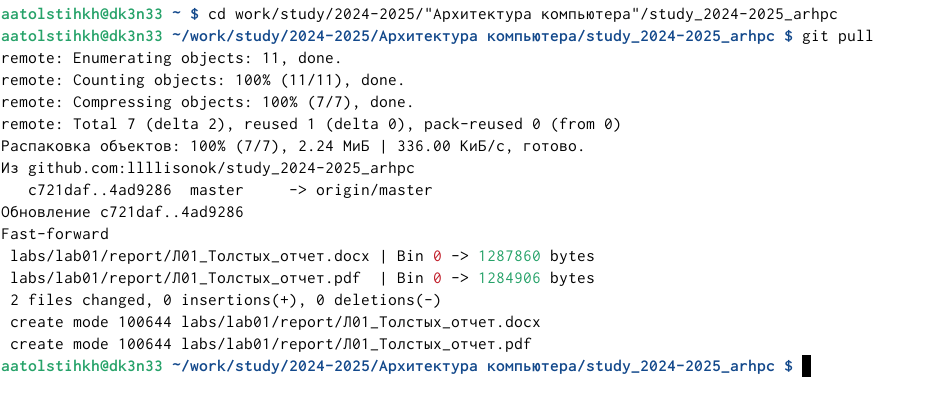
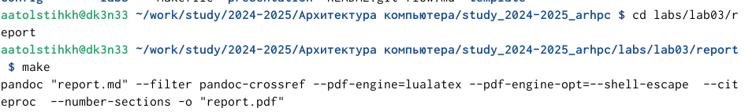
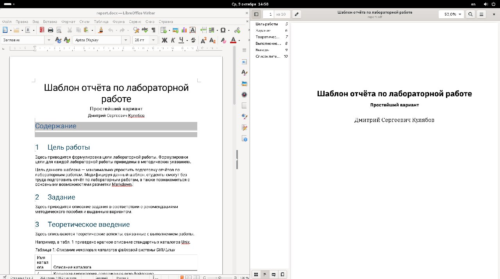
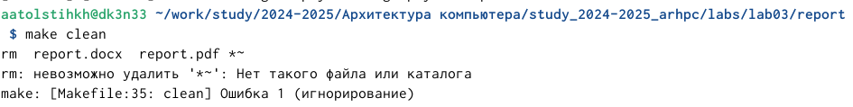
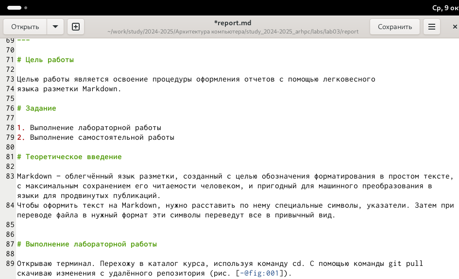
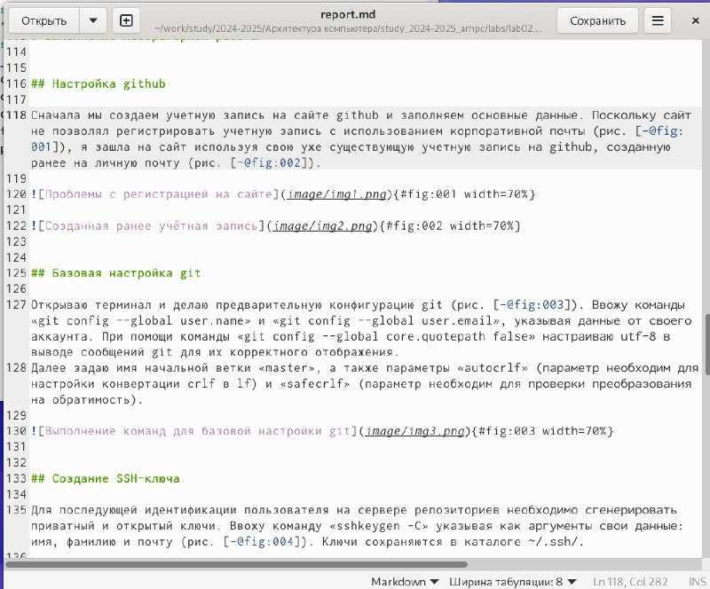
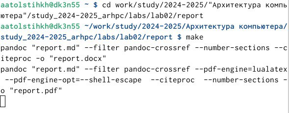
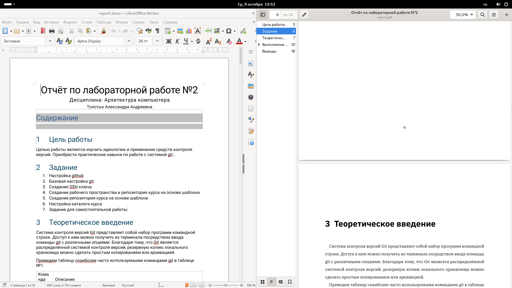
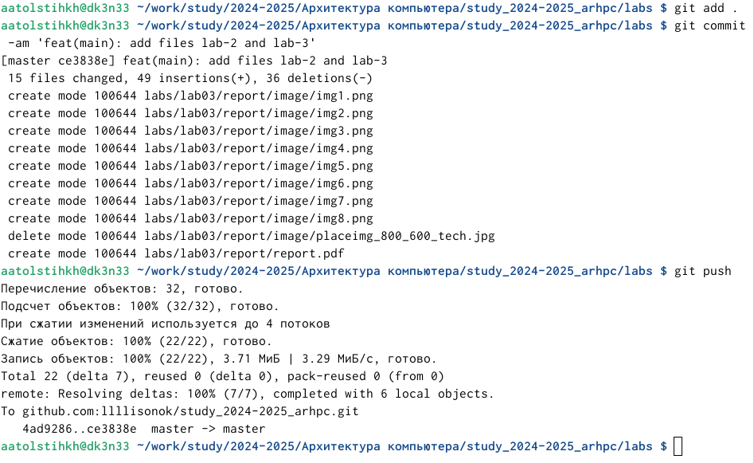

---
## Front matter
title: "Отчёт по лабораторной работе №3"
subtitle: "Дисциплина: Архитектура компьютера"
author: "Толстых Александра Андреевна"

## Generic otions
lang: ru-RU
toc-title: "Содержание"

## Bibliography
bibliography: bib/cite.bib
csl: pandoc/csl/gost-r-7-0-5-2008-numeric.csl

## Pdf output format
toc: true # Table of contents
toc-depth: 2
lof: true # List of figures
fontsize: 12pt
linestretch: 1.5
papersize: a4
documentclass: scrreprt
## I18n polyglossia
polyglossia-lang:
  name: russian
  options:
	- spelling=modern
	- babelshorthands=true
polyglossia-otherlangs:
  name: english
## I18n babel
babel-lang: russian
babel-otherlangs: english
## Fonts
mainfont: IBM Plex Serif
romanfont: IBM Plex Serif
sansfont: IBM Plex Sans
monofont: IBM Plex Mono
mathfont: STIX Two Math
mainfontoptions: Ligatures=Common,Ligatures=TeX,Scale=0.94
romanfontoptions: Ligatures=Common,Ligatures=TeX,Scale=0.94
sansfontoptions: Ligatures=Common,Ligatures=TeX,Scale=MatchLowercase,Scale=0.94
monofontoptions: Scale=MatchLowercase,Scale=0.94,FakeStretch=0.9
mathfontoptions:
## Biblatex
biblatex: true
biblio-style: "gost-numeric"
biblatexoptions:
  - parentracker=true
  - backend=biber
  - hyperref=auto
  - language=auto
  - autolang=other*
  - citestyle=gost-numeric
## Pandoc-crossref LaTeX customization
figureTitle: "Рис."
tableTitle: "Таблица"
listingTitle: "Листинг"
lofTitle: "Список иллюстраций"
lotTitle: "Список таблиц"
lolTitle: "Листинги"
## Misc options
indent: true
header-includes:
  - \usepackage{indentfirst}
  - \usepackage{float} # keep figures where there are in the text
  - \floatplacement{figure}{H} # keep figures where there are in the text
---

# Цель работы

Целью работы является освоение процедуры оформления отчетов с помощью легковесного
языка разметки Markdown.

# Задание

1. Выполнение лабораторной работы
2. Выполнение самостоятельной работы

# Теоретическое введение

Markdown — облегчённый язык разметки, созданный с целью обозначения форматирования в простом тексте, с максимальным сохранением его читаемости человеком, и пригодный для машинного преобразования в языки для продвинутых публикаций.
Чтобы оформить текст на Markdown, нужно расставить по нему специальные символы, указатели. Затем при переводе файла в нужный формат эти символы переведут все в привычный вид.

# Выполнение лабораторной работы

## Выполнение лабораторной работы: написание отчета третьей лабораторной работы.

Открываю терминал. Перехожу в каталог курса, используя команду cd. С помощью команды git pull скачиваю изменения с удалённого репозитория (рис. [-@fig:001]). 

{#fig:001 width=70%}

Перехожу в каталог с шаблоном отчета по лабораторной работе №3. Используя команду make провожу компиляцию шаблона с использованием Markdown (рис. [-@fig:002]).

{#fig:002 width=70%}

Затем открываю созданные файлы и убеждаюсь, что все выполнилось корректно (рис. [-@fig:003]).

{#fig:003 width=70%}

Удаляю созданные файлы при помощи команды make clean (рис. [-@fig:004]).

{#fig:004 width=70%}

Далее при помощи текстового редактора открываю файл report.md и заполняю отчет (рис. [-@fig:005]).

{#fig:005 width=70%}

Заполнив отчет, компилирую файл вновь. Затем сохраняю изменения на github при помощи команд "git add", "git commit -am", "git push".

## Выполнение самостоятельной работы: написание отчета второй лабораторной работы.

Перед написанием отчета о третьей лабороторной выполняю самостоятельную работу. Открываю в текстовом редакторе файл report.md из каталога второй лабораторной и пишу отчет о выполнении работы (рис. [-@fig:006]).

{#fig:006 width=70%}

 Закончив написание сохраняю файлы и открываю терминал. Там при помощи команды cd перемещаюсь в каталог labs/lab02 и при помощи команды make компилирую отчет (рис. [-@fig:007]).

{#fig:007 width=70%}

Когда файлы отчета создаются - открываю их и проверяю что все прошло корректно (рис. [-@fig:008]).

{#fig:008 width=70%}

Далее сохраняю изменения на github при помощи команд "git add", "git commit -am", "git push" (рис. [-@fig:009]).

{#fig:009 width=70%}

# Выводы

В результате выполнения работы я освоила процедуру оформления отчетов с помощью легковесного
языка разметки Markdown.
