---
## Front matter
title: "Отчёт по лабораторной работе №4"
subtitle: "Дисциплина: Архитектура компьютера"
author: "Толстых Александра Андреевна"

## Generic otions
lang: ru-RU
toc-title: "Содержание"

## Bibliography
bibliography: bib/cite.bib
csl: pandoc/csl/gost-r-7-0-5-2008-numeric.csl

## Pdf output format
toc: true # Table of contents
toc-depth: 2
lof: true # List of figures
lot: true # List of tables
fontsize: 12pt
linestretch: 1.5
papersize: a4
documentclass: scrreprt
## I18n polyglossia
polyglossia-lang:
  name: russian
  options:
	- spelling=modern
	- babelshorthands=true
polyglossia-otherlangs:
  name: english
## I18n babel
babel-lang: russian
babel-otherlangs: english
## Fonts
mainfont: IBM Plex Serif
romanfont: IBM Plex Serif
sansfont: IBM Plex Sans
monofont: IBM Plex Mono
mathfont: STIX Two Math
mainfontoptions: Ligatures=Common,Ligatures=TeX,Scale=0.94
romanfontoptions: Ligatures=Common,Ligatures=TeX,Scale=0.94
sansfontoptions: Ligatures=Common,Ligatures=TeX,Scale=MatchLowercase,Scale=0.94
monofontoptions: Scale=MatchLowercase,Scale=0.94,FakeStretch=0.9
mathfontoptions:
## Biblatex
biblatex: true
biblio-style: "gost-numeric"
biblatexoptions:
  - parentracker=true
  - backend=biber
  - hyperref=auto
  - language=auto
  - autolang=other*
  - citestyle=gost-numeric
## Pandoc-crossref LaTeX customization
figureTitle: "Рис."
tableTitle: "Таблица"
listingTitle: "Листинг"
lofTitle: "Список иллюстраций"
lotTitle: "Список таблиц"
lolTitle: "Листинги"
## Misc options
indent: true
header-includes:
  - \usepackage{indentfirst}
  - \usepackage{float} # keep figures where there are in the text
  - \floatplacement{figure}{H} # keep figures where there are in the text
---

# Цель работы

Освоение процедуры компиляции и сборки программ, написанных на ассемблере NASM.

# Задание

1. Программа Hello world!
2. Транслятор NASM
3. Расширенный синтаксис командной строки NASM
4. Компоновщик LD
5. Запуск исполняемого файла
6. Задание для самостоятельной работы

# Выполнение лабораторной работы

## Программа Hello world!

Создаю каталог для работы с программами на языке ассемблера NASM. Затем перехожу в созданный каталог и создаю текстовый файл с именем hello.asm. Открываю его при помощи текстового редактора gedit. (рис. [-@fig:001]).

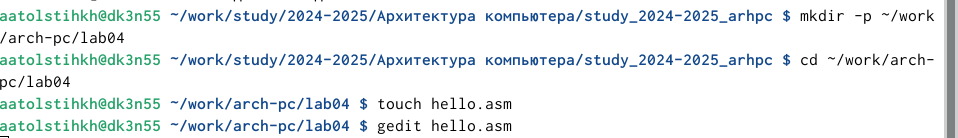{#fig:001 width=70%}

Ввожу указанный текст. (рис. [-@fig:002]).

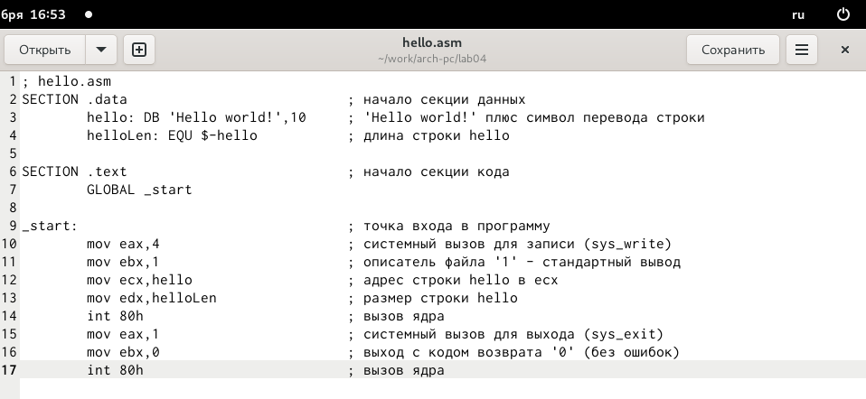{#fig:002 width=70%}

## Транслятор NASM

Превращаю текст для программы в объектный код с помощью транслятора NASM. Далее проверяю правильность выполнения команды при помощи ls. (рис. [-@fig:003]).

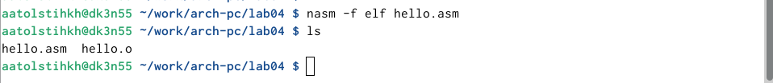{#fig:003 width=70%}

Объектный файл имеет имя "hello.o"

## Расширенный синтаксис командной строки NASM

Ввожу команду, которая скомпилирует файл hello.asm в файл obj.o, при этом в файл будут включены символы для отладки, а также будет создан файл листинга. При помощи ls также проверяю корректность выполнения программы. (рис. [-@fig:004]).

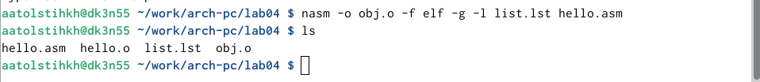{#fig:004 width=70%}

## Компоновщик LD

Передаю объектный файл на обработку компоновщику LD, чтобы получить исполняемый файл hello. Далее проверяю с помощью ls правильность выполнения команды. (рис. [-@fig:005]).

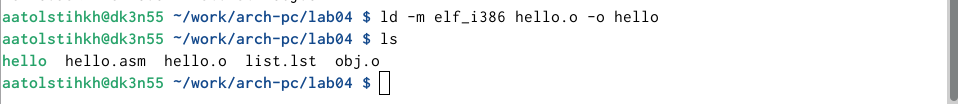{#fig:005 width=70%}

Выполняю следующую команду. Исполняемый файл будет иметь имя main, так как после ключа -o было задано значение main. Объектный файл, из которого собран этот исполняемый файл имеет имя obj.o. (рис. [-@fig:006]).

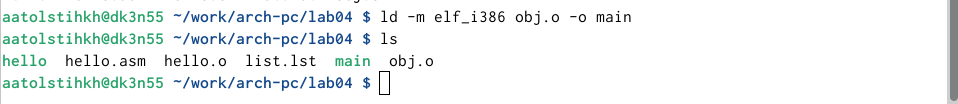{#fig:006 width=70%}

## Запуск исполняемого файла

Запускаю исполняемый файл hello. (рис. [-@fig:007]).

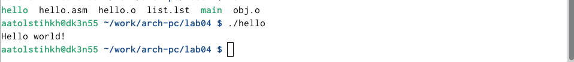{#fig:007 width=70%}

## Задание для самостоятельной работы

В каталоге ~/work/arch-pc/lab04 с помощью команды cp создаю копию файла hello.asm с именем lab4.asm. (рис. [-@fig:008]).

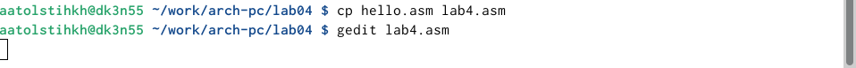{#fig:008 width=70%}

С помощью gedit вношу изменения в текст программы в файле lab4.asm так, чтобы вместо Hello world! на экран выводилась строка с моими фамилией и именем (рис. [-@fig:009]).

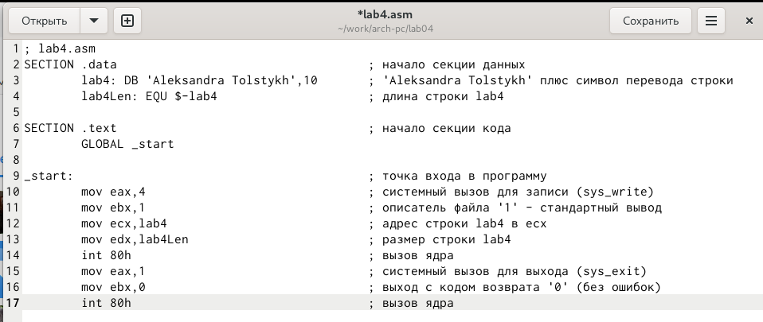{#fig:009 width=70%}

Транслирую полученный текст программы lab4.asm в объектный файл.(рис. [-@fig:010]).

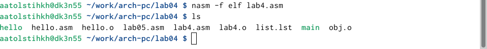{#fig:010 width=70%}

Выполняю компоновку объектного файла (рис. [-@fig:011]).

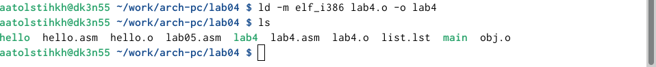{#fig:011 width=70%}

Запускаю получившийся исполняемый файл.(рис. [-@fig:012]).

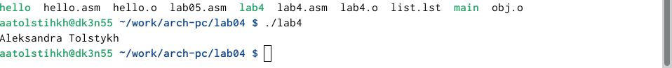{#fig:012 width=70%}

Копирую указанные файлы в локальный репозиторий в каталог с 4 лабораторной. (рис. [-@fig:013]).

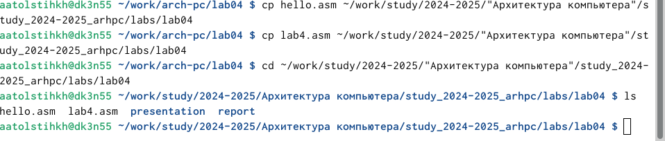{#fig:013 width=70%}

Отправляю изменения на гитхаб. (рис. [-@fig:014]).

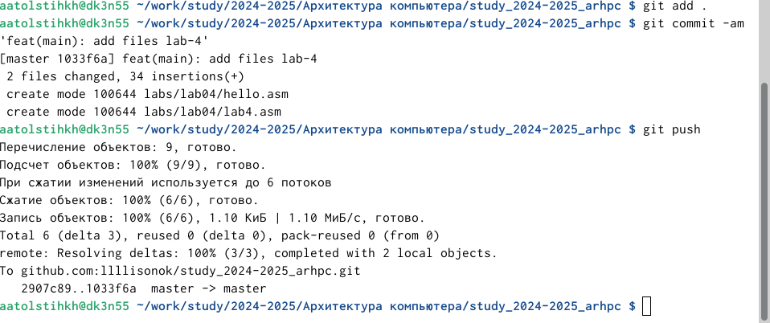{#fig:014 width=70%}

# Выводы

При выполнении данной лабораторной работы я освоила процедуры компиляции и сборки программ, написанных на ассемблере NASM.
