---
## Front matter
title: "Отчёт по лабораторной работе №5"
subtitle: "Дисциплина: Архитектура компьютера"
author: "Толстых Александра Андреевна"

## Generic otions
lang: ru-RU
toc-title: "Содержание"

## Bibliography
bibliography: bib/cite.bib
csl: pandoc/csl/gost-r-7-0-5-2008-numeric.csl

## Pdf output format
toc: true # Table of contents
toc-depth: 2
lof: true # List of figures
lot: true # List of tables
fontsize: 12pt
linestretch: 1.5
papersize: a4
documentclass: scrreprt
## I18n polyglossia
polyglossia-lang:
  name: russian
  options:
	- spelling=modern
	- babelshorthands=true
polyglossia-otherlangs:
  name: english
## I18n babel
babel-lang: russian
babel-otherlangs: english
## Fonts
mainfont: IBM Plex Serif
romanfont: IBM Plex Serif
sansfont: IBM Plex Sans
monofont: IBM Plex Mono
mathfont: STIX Two Math
mainfontoptions: Ligatures=Common,Ligatures=TeX,Scale=0.94
romanfontoptions: Ligatures=Common,Ligatures=TeX,Scale=0.94
sansfontoptions: Ligatures=Common,Ligatures=TeX,Scale=MatchLowercase,Scale=0.94
monofontoptions: Scale=MatchLowercase,Scale=0.94,FakeStretch=0.9
mathfontoptions:
## Biblatex
biblatex: true
biblio-style: "gost-numeric"
biblatexoptions:
  - parentracker=true
  - backend=biber
  - hyperref=auto
  - language=auto
  - autolang=other*
  - citestyle=gost-numeric
## Pandoc-crossref LaTeX customization
figureTitle: "Рис."
tableTitle: "Таблица"
listingTitle: "Листинг"
lofTitle: "Список иллюстраций"
lotTitle: "Список таблиц"
lolTitle: "Листинги"
## Misc options
indent: true
header-includes:
  - \usepackage{indentfirst}
  - \usepackage{float} # keep figures where there are in the text
  - \floatplacement{figure}{H} # keep figures where there are in the text
---

# Цель работы

Приобретение практических навыков работы в Midnight Commander. Освоение инструкций языка ассемблера mov и int.

# Задание

1. Основы работы с mc
2. Подключение внешнего файла
3. Выполнение заданий для самостоятельной работы

# Выполнение лабораторной работы

## Основы работы с mc 

Ввожу в терминал команду "mc" и открываю midnight commander (рис. [-@fig:001]).

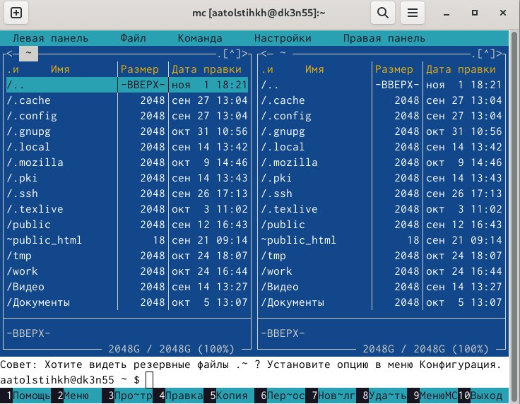{#fig:001 width=70%}

Используя указанные клавиши перехожу к каталогу ~/work/arch-pc, созданному в ходе выполнения прошлой лабораторной работы  (рис. [-@fig:002]).

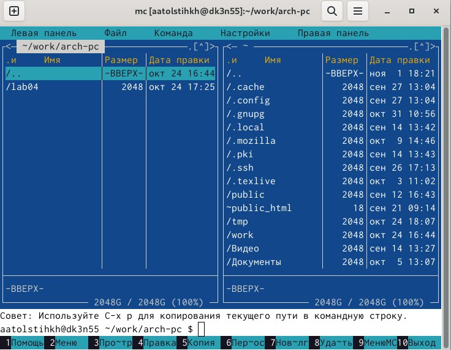{#fig:002 width=70%}

С помощью функциональной клавиши F7 создаю папку lab05 (рис. [-@fig:003]).

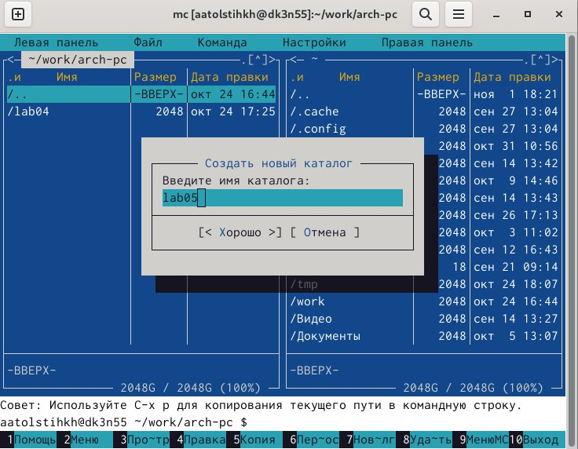{#fig:003 width=70%}

Перехожу в нужный каталог (рис. [-@fig:004]).

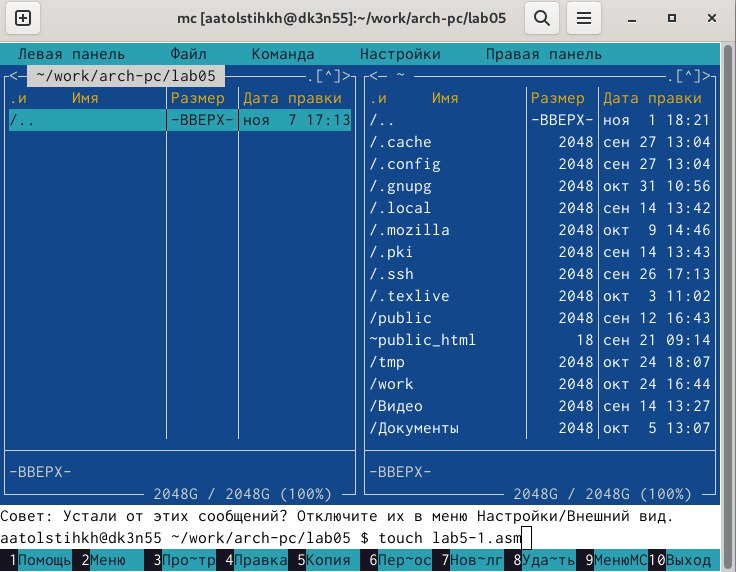{#fig:004 width=70%}

Используя строку ввода и команду touch создаю файл lab5-1.asm (рис. [-@fig:005]).

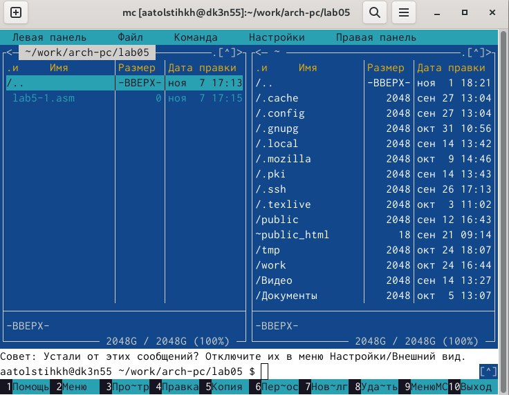{#fig:005 width=70%}

С помощью функциональной клавиши F4 открываю файл lab5-1.asm для редактирования и ввожу текст указанной программы. (рис. [-@fig:006]).

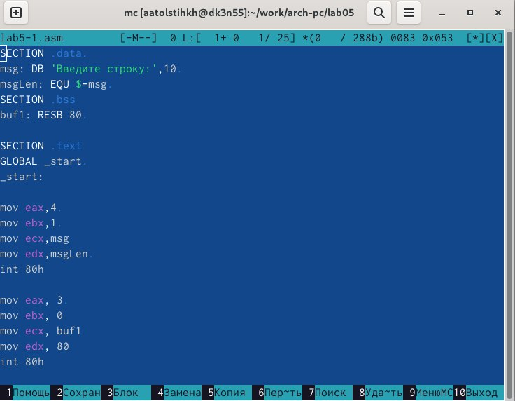{#fig:006 width=70%}

С помощью функциональной клавиши F3 открываю файл для просмотра и проверяю, что он содержит текст программы (рис. [-@fig:007]).

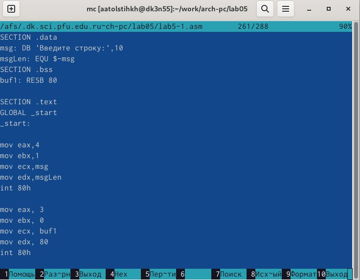{#fig:007 width=70%}

Транслирую текст программы файла в объектный файл командой nasm -f elf lab5-1.asm. Создался объектный файл lab5-1.o. Выполняю компоновку объектного файла с помощью команды ld -m elf_i386 -o lab5-1 lab5-1.o. Создался исполняемый файл lab5-1. Запускаю его. На запрос ввода строки ввожу свои ФИО (рис. [-@fig:008]).

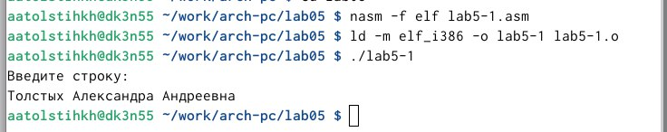{#fig:008 width=70%}

## Подключение внешнего файла in_out.asm

Скачиваю файл in_out.asm со страницы курса в ТУИС. Он должен располагаться в том же каталоге, что и файл с программой, в которой он используется. Поэтому копирую его при помощи функциональной клавиши F5 в нужный каталог (рис. [-@fig:009]).

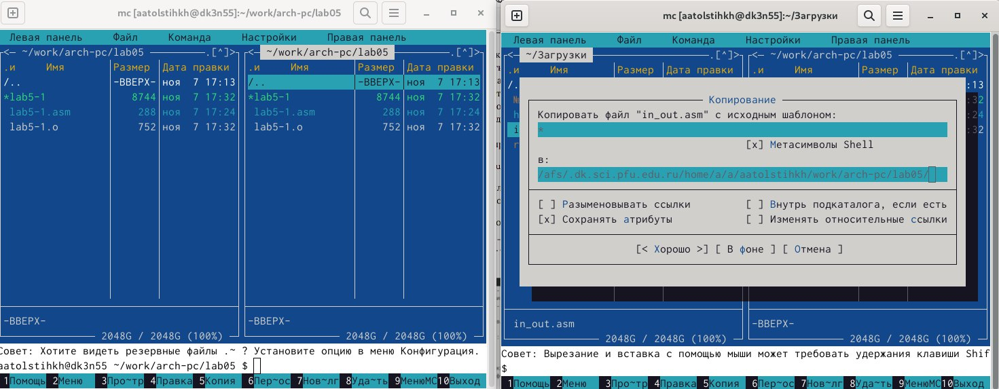{#fig:009 width=70%}

Создаю копию файла lab5-1.asm с именем lab5-2.asm. (Я ошиблась клавишей, поэтому после этого создала файл lab5-1.asm заново.) (рис. [-@fig:010]).

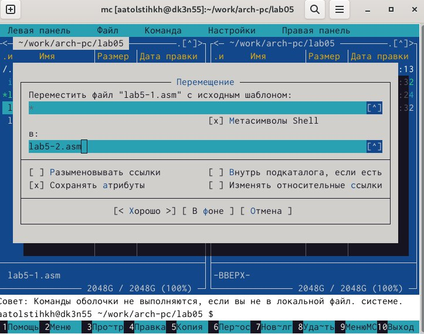{#fig:010 width=70%}

В копии файла исправляю программу указанным образом (рис. [-@fig:011]).

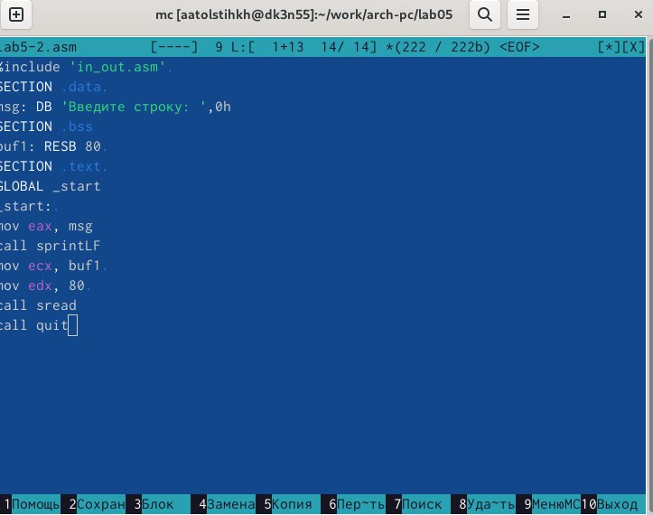{#fig:011 width=70%}

Запускаю новый файл и проверяю его работу (рис. [-@fig:012]).

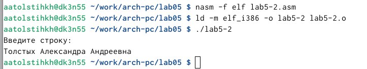{#fig:012 width=70%}

Заменяю sprintLF на sprint (рис. [-@fig:013]).

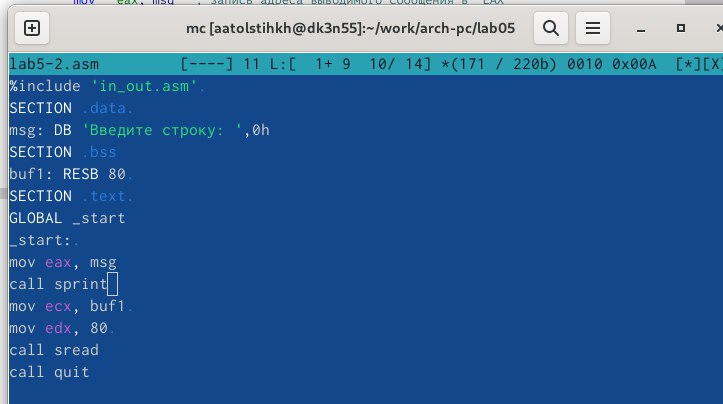{#fig:013 width=70%}

Запускаю программу и сравниваю результат. Разница в том, что запуск первого варианта программы запрашивает ввод с новой строки, а запуск второго варианта программы запрашивает ввод без переноса на новую строку, потому что в этом заключается различие между подпрограммами sprintLF и sprint (рис. [-@fig:014]).

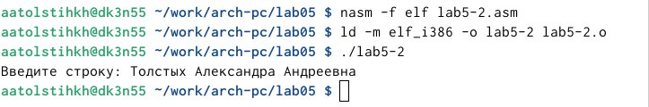{#fig:014 width=70%}

## Выполнение заданий для самостоятельной работы

Создаю копию файла lab5-1.asm (рис. [-@fig:015]).

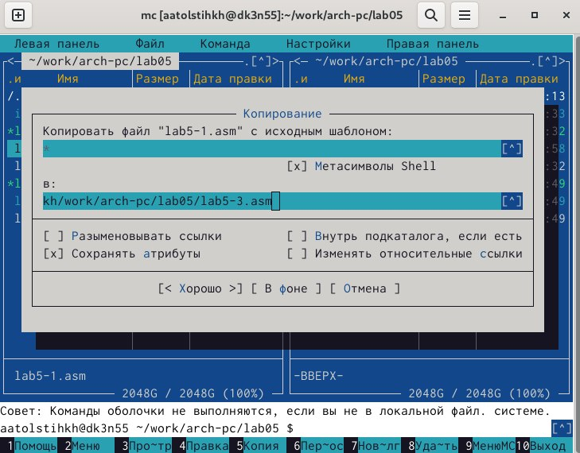{#fig:015 width=70%}

Редактирую программу так, чтобы кроме вывода приглашения и запроса ввода, она выводила вводимую пользователем строку. (рис. [-@fig:016]).

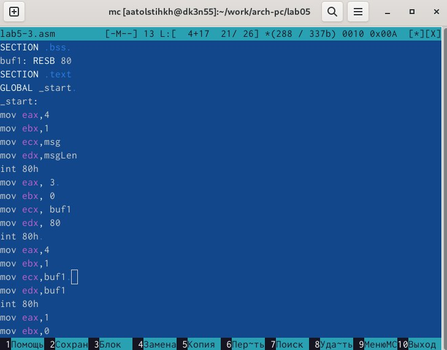{#fig:016 width=70%}

Запускаю программу, на запрос ввести строку ввожу свою фамилию (рис. [-@fig:017]).

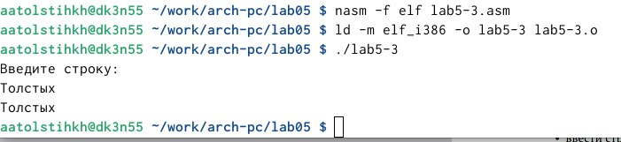{#fig:017 width=70%}

Создаю копию файла lab5-2.asm (рис. [-@fig:018]).

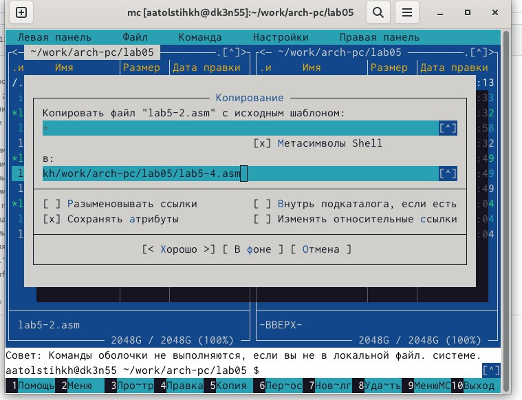{#fig:018 width=70%}

Редактирую программу так, чтобы кроме вывода приглашения и запроса ввода, она выводила вводимую пользователем строку (рис. [-@fig:019]).

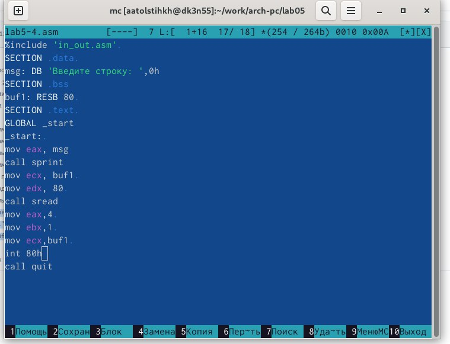{#fig:019 width=70%}

Запускаю программу, на запрос ввести строку ввожу свою фамилию (рис. [-@fig:020]).

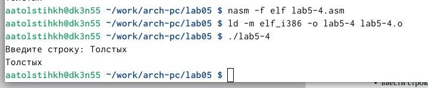{#fig:020 width=70%}

# Выводы

При выполнении данной лабораторной работы я приобрела практические навыки работы в Midnight Commander, а также освоила инструкции языка ассемблера mov и int.
