---
## Front matter
title: "Отчёт по лабораторной работе №7"
subtitle: "Дисциплина: Архитектура компьютера"
author: "Толстых Александра Андреевна"

## Generic otions
lang: ru-RU
toc-title: "Содержание"

## Bibliography
bibliography: bib/cite.bib
csl: pandoc/csl/gost-r-7-0-5-2008-numeric.csl

## Pdf output format
toc: true # Table of contents
toc-depth: 2
lof: true # List of figures
fontsize: 12pt
linestretch: 1.5
papersize: a4
documentclass: scrreprt
## I18n polyglossia
polyglossia-lang:
  name: russian
  options:
	- spelling=modern
	- babelshorthands=true
polyglossia-otherlangs:
  name: english
## I18n babel
babel-lang: russian
babel-otherlangs: english
## Fonts
mainfont: IBM Plex Serif
romanfont: IBM Plex Serif
sansfont: IBM Plex Sans
monofont: IBM Plex Mono
mathfont: STIX Two Math
mainfontoptions: Ligatures=Common,Ligatures=TeX,Scale=0.94
romanfontoptions: Ligatures=Common,Ligatures=TeX,Scale=0.94
sansfontoptions: Ligatures=Common,Ligatures=TeX,Scale=MatchLowercase,Scale=0.94
monofontoptions: Scale=MatchLowercase,Scale=0.94,FakeStretch=0.9
mathfontoptions:
## Biblatex
biblatex: true
biblio-style: "gost-numeric"
biblatexoptions:
  - parentracker=true
  - backend=biber
  - hyperref=auto
  - language=auto
  - autolang=other*
  - citestyle=gost-numeric
## Pandoc-crossref LaTeX customization
figureTitle: "Рис."
tableTitle: "Таблица"
listingTitle: "Листинг"
lofTitle: "Список иллюстраций"
lolTitle: "Листинги"
## Misc options
indent: true
header-includes:
  - \usepackage{indentfirst}
  - \usepackage{float} # keep figures where there are in the text
  - \floatplacement{figure}{H} # keep figures where there are in the text
---

# Цель работы

Изучение команд условного и безусловного переходов. Приобретение навыков написания
программ с использованием переходов. Знакомство с назначением и структурой файла
листинга.

# Задание

1. Реализация переходов в NASM
2. Изучение структуры файлы листинга
3. Задание для самостоятельной работы

# Выполнение лабораторной работы

## Реализация переходов в NASM

Создаю каталог для программ лабораторной работы №7, перехожу в него и создаю файл lab7-1.asm (рис. [-@fig:001]).

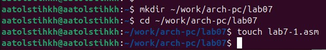{#fig:001 width=60%}

Ввожу в созданный файл текст программы из листинга (рис. [-@fig:002]).

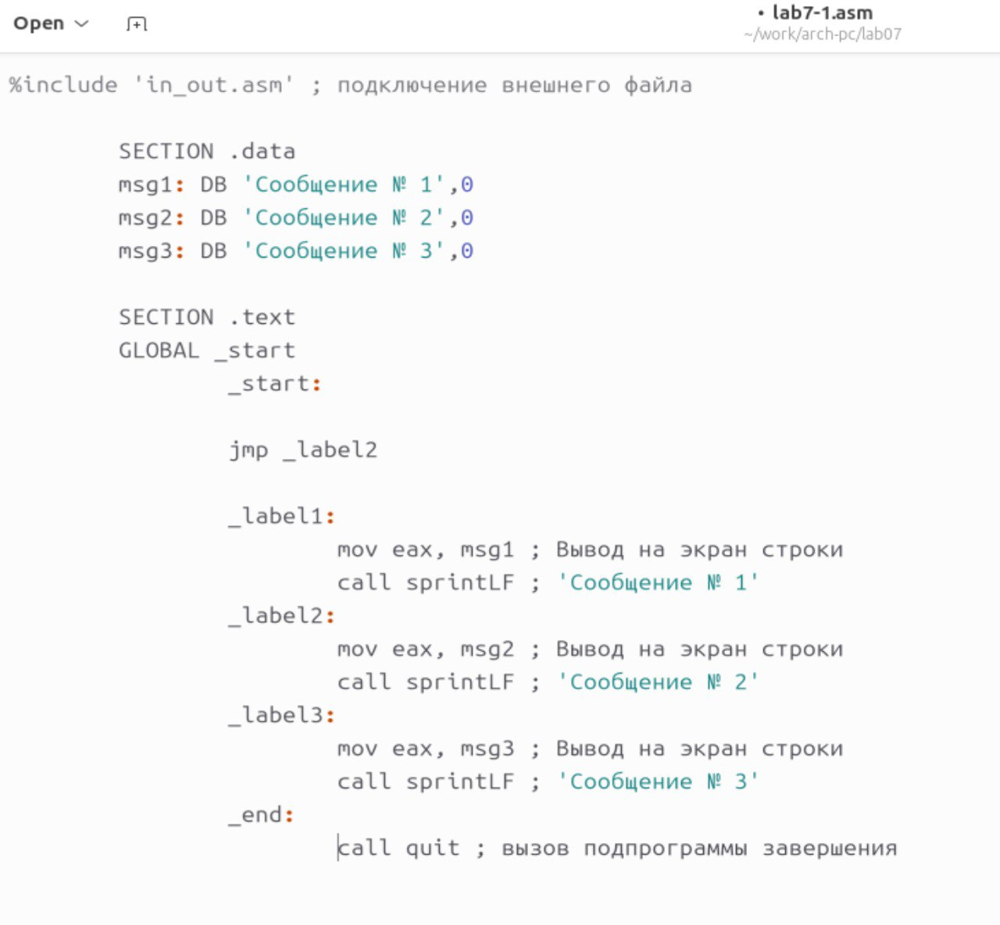{#fig:002 width=60%}

Создаю исполняемый файл и запускаю его (рис. [-@fig:003]). Вывод программы корректный.

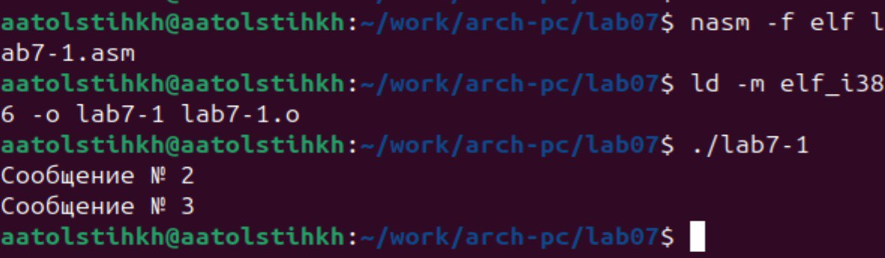{#fig:003 width=70%}

Изменяю программу так, чтобы она сначала выводила второе сообщение, затем первое (рис. [-@fig:004]).

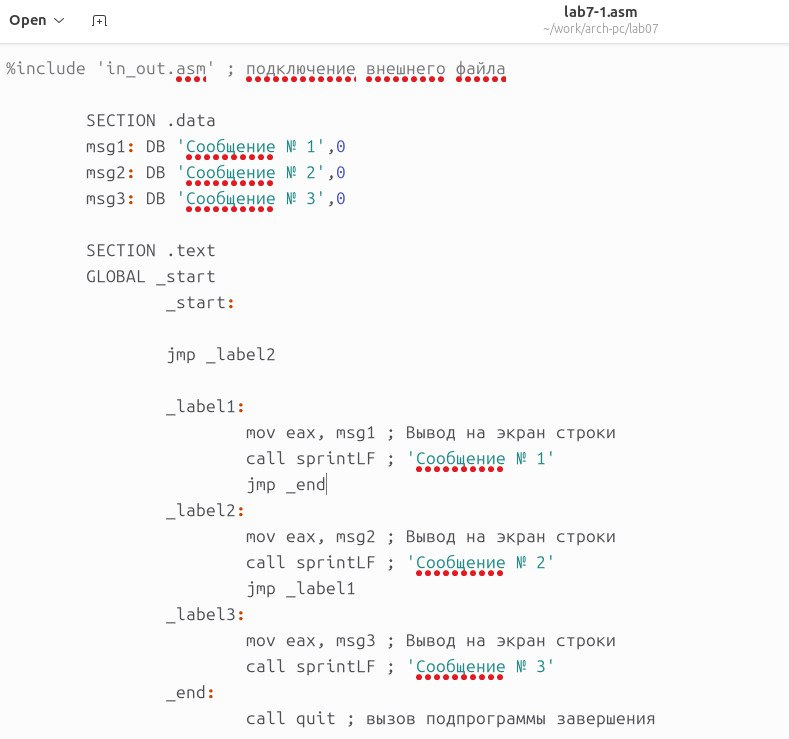{#fig:004 width=70%}

Создаю исполняемый файл и запускаю его (рис. [-@fig:005]). Вывод программы корректный.

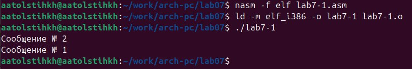{#fig:005 width=70%}

Изменяю программу так, чтобы она выводила все три сообщения, но в обратном порядке (рис. [-@fig:006]).

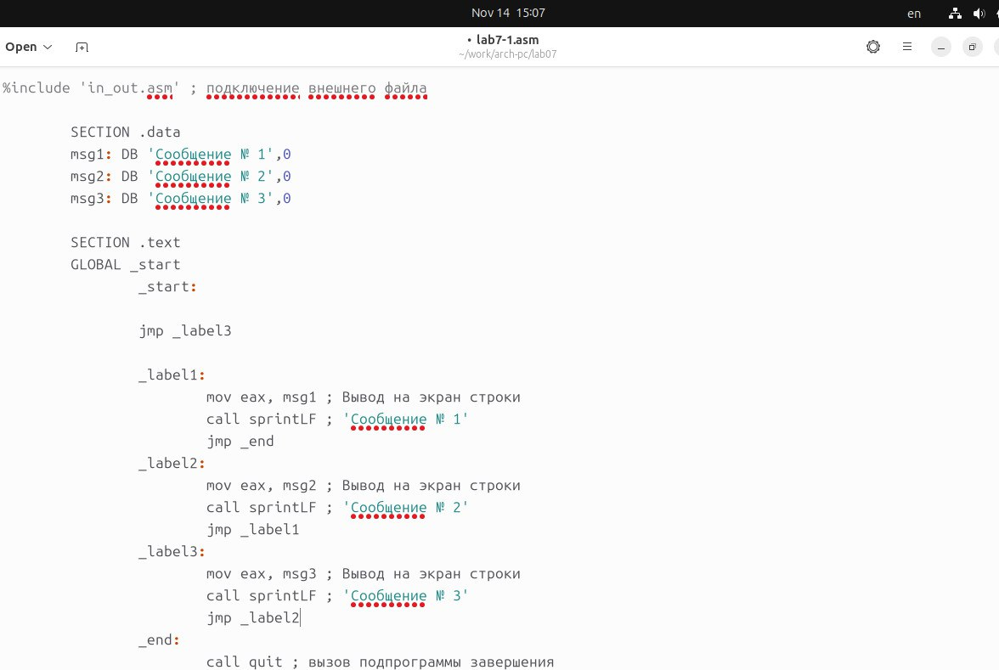{#fig:006 width=70%}

Создаю исполняемый файл и запускаю его (рис. [-@fig:007]). Вывод программы корректный.

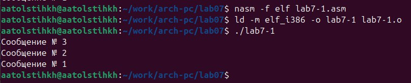{#fig:007 width=70%}

Создаю файл lab7-2 и ввожу в него указанный текст программы (рис. [-@fig:008]).

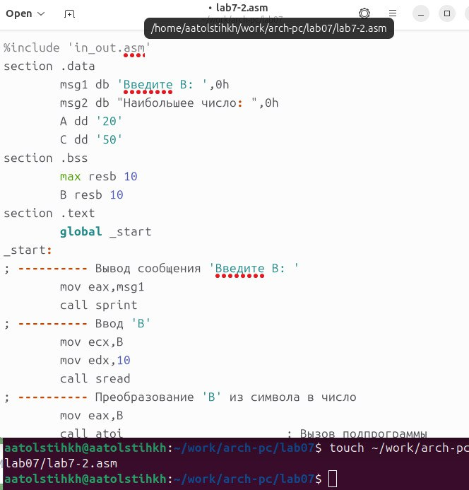{#fig:008 width=70%}

Создаю исполняемый файл и запускаю его (рис. [-@fig:009]). Проверяю работу программы на нескольких значениях.

{#fig:009 width=70%}

## Изучение структуры файлы листинга

Создаю файл листинга для программы из файла lab7-2.asm (рис. [-@fig:010]).

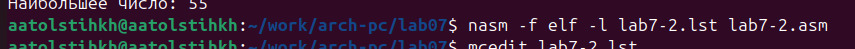{#fig:010 width=70%}

После ознакомления с файлом и его содержимым, а затем выбираю три строки и изучаю их детально.

Первой рассматриваю строку номер 25 (рис. [-@fig:011]). Ее адрес "00000110", Машинный код - 8B0D[35000000], а mov ecx,[A] - исходный текст программы, означающий что в регистр ecx мы вносим значения переменной A. 

{#fig:011 width=70%}

Далее рассматриваю строку номер 35 (рис. [-@fig:012]). Ее адрес "00000135", Машинный код - E862FFFFFF, а call atoi - исходный текст программы, означающий что символ, лежащий в строке выше, переводится в число. 

{#fig:012 width=70%}

Последней строкой я изучаю строку номер 38 (рис. [-@fig:013]). Ее адрес "0000013F", Машинный код - 8B0D[00000000], а mov ecx,[max] - исходный текст программы, означающий что в регистр ecx мы вносим значения переменной max. 

{#fig:013 width=70%}

Открываю файл программы и убираю второй операнд у одной из инструкций (рис. [-@fig:014]).

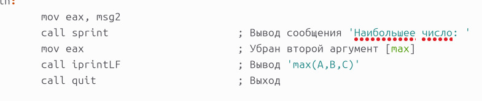{#fig:014 width=70%}

Выполняю трансляцию файла с получением файла листинга (рис. [-@fig:015]).

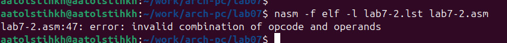{#fig:015 width=70%}

Подробно вывожу содержимое каталога, чтобы понять какие файлы создались (рис. [-@fig:016]). После возникновения ошибки создался только файл листинга.

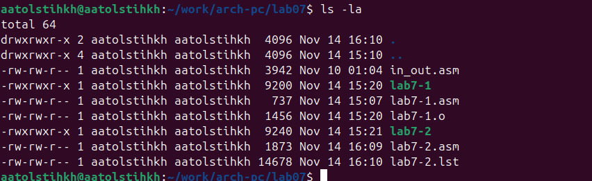{#fig:016 width=70%}

Внимательно изучаю файл листинга и нахожу отличие: после строки, на которой возникла ошибка - находится сообщение об этом, с указанием конкретной ошибки (рис. [-@fig:017]).

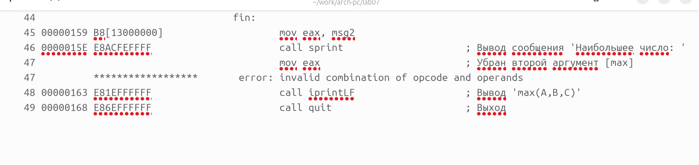{#fig:017 width=70%}

## Задание для самостоятельной работы

Перехожу к выполнению заданий для самостоятельной работы. Создаю программу, которая определяет какое из трех введенных чисел - наименьшее (рис. [-@fig:018]).

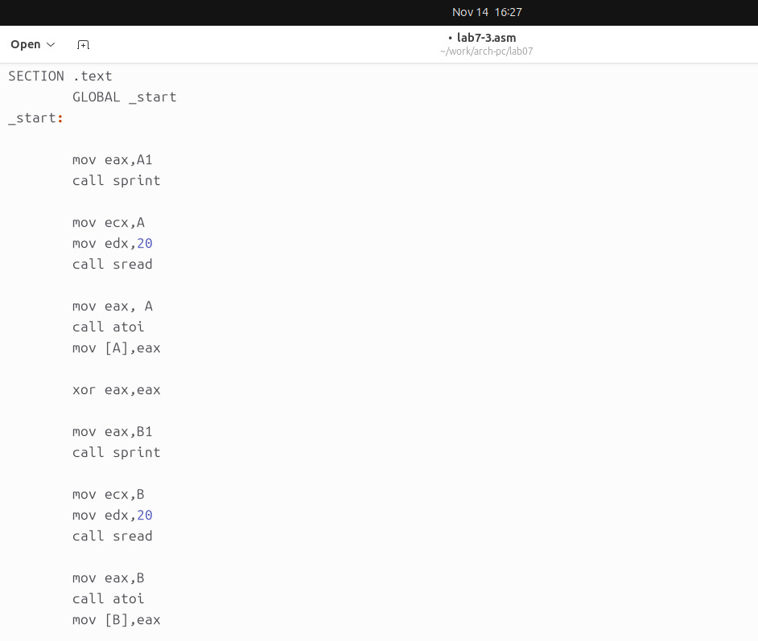{#fig:018 width=70%}

Создаю исполняемый файл и проверяю его работу на трех значениях, соответствующих моему варианту (16) (рис. [-@fig:019]).

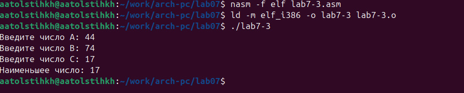{#fig:019 width=70%}

Убеждаюсь, что все работает корректно, а затем создаю новую программу. Она вычисляет значение заданной функции (16 вариант) для введенных значений x, a (рис. [-@fig:020]).

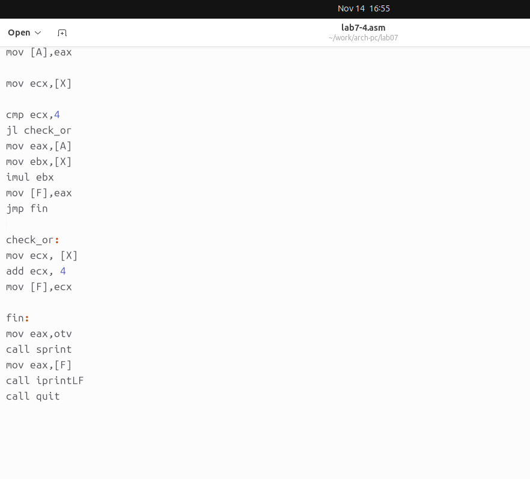{#fig:020 width=70%}

Создаю исполняемый файл и проверяю его работу на значениях, соответствующих моему варианту (16) (рис. [-@fig:021]).

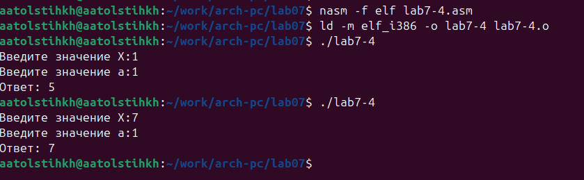{#fig:021 width=70%}

# Выводы

В ходе выполнения лабораторной работы я изучила команды условного и безусловного переходов, а также приобрела навыки написания программ с использованием переходов, познакомилась с назначением и структурой файла листинга.
