---
## Front matter
title: "Отчёт по лабораторной работе №8"
subtitle: "Дисциплина: Архитектура компьютера"
author: "Толстых Александра Андреевна"

## Generic otions
lang: ru-RU
toc-title: "Содержание"

## Bibliography
bibliography: bib/cite.bib
csl: pandoc/csl/gost-r-7-0-5-2008-numeric.csl

## Pdf output format
toc: true # Table of contents
toc-depth: 2
lof: true # List of figures
fontsize: 12pt
linestretch: 1.5
papersize: a4
documentclass: scrreprt
## I18n polyglossia
polyglossia-lang:
  name: russian
  options:
	- spelling=modern
	- babelshorthands=true
polyglossia-otherlangs:
  name: english
## I18n babel
babel-lang: russian
babel-otherlangs: english
## Fonts
mainfont: IBM Plex Serif
romanfont: IBM Plex Serif
sansfont: IBM Plex Sans
monofont: IBM Plex Mono
mathfont: STIX Two Math
mainfontoptions: Ligatures=Common,Ligatures=TeX,Scale=0.94
romanfontoptions: Ligatures=Common,Ligatures=TeX,Scale=0.94
sansfontoptions: Ligatures=Common,Ligatures=TeX,Scale=MatchLowercase,Scale=0.94
monofontoptions: Scale=MatchLowercase,Scale=0.94,FakeStretch=0.9
mathfontoptions:
## Biblatex
biblatex: true
biblio-style: "gost-numeric"
biblatexoptions:
  - parentracker=true
  - backend=biber
  - hyperref=auto
  - language=auto
  - autolang=other*
  - citestyle=gost-numeric
## Pandoc-crossref LaTeX customization
figureTitle: "Рис."
tableTitle: "Таблица"
listingTitle: "Листинг"
lofTitle: "Список иллюстраций"
lolTitle: "Листинги"
## Misc options
indent: true
header-includes:
  - \usepackage{indentfirst}
  - \usepackage{float} # keep figures where there are in the text
  - \floatplacement{figure}{H} # keep figures where there are in the text
---

# Цель работы

Приобретение навыков написания программ с использованием циклов и обработкой
аргументов командной строки.

# Задание

1. Реализация циклов в NASM
2. Обработка аргументов командной строки
3. Задание для самостоятельной работы

# Выполнение лабораторной работы

## Реализация циклов в NASM

Создаю каталог для программ лабораторной работы № 8, перехожу в него и создаю файл lab8-1.asm (рис. [-@fig:001]).

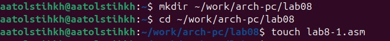{#fig:001 width=70%}

Ввожу в файл lab8-1.asm текст программы из листинга 8.1 (рис. [-@fig:002]).

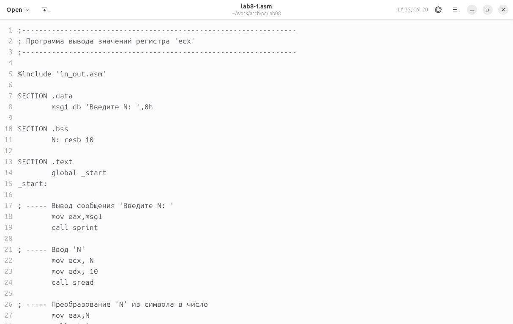{#fig:002 width=80%}

Создаю исполняемый файл и проверяю его работу. Анализируя результат, замечаю, что использование регистра ecx в теле цилка loop может привести к некорректной работе программы (рис. [-@fig:003]).

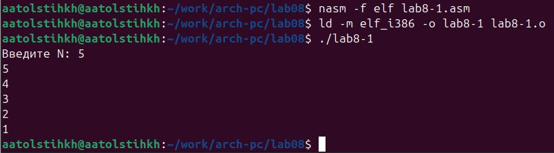{#fig:003 width=70%}

Изменяю текст программы добавив изменение значения регистра ecx в цикле (рис. [-@fig:004]).

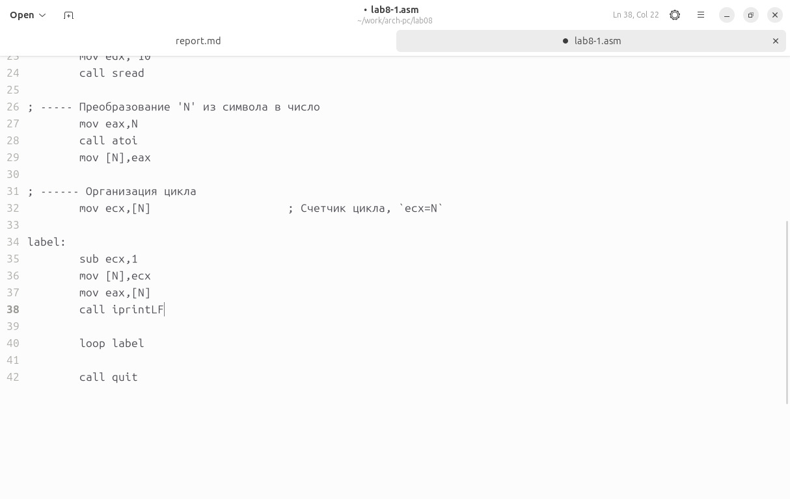{#fig:004 width=80%}

Создаю исполняемый файл и проверяю его работу. Регистр ecx в цикле принимает значения, отличающиеся на 2, а также после 0 работает некорректно (рис. [-@fig:005]).

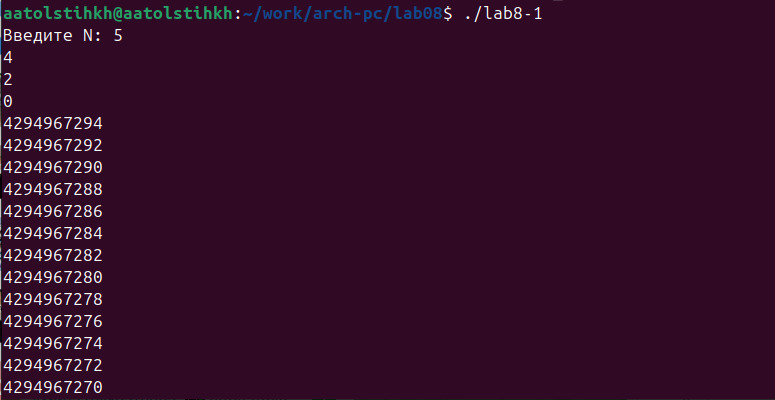{#fig:005 width=70%}

Вношу изменения в текст программы добавив команды push и pop (добавления в стек и извлечения из стека) для сохранения значения счетчика цикла (рис. [-@fig:006]).

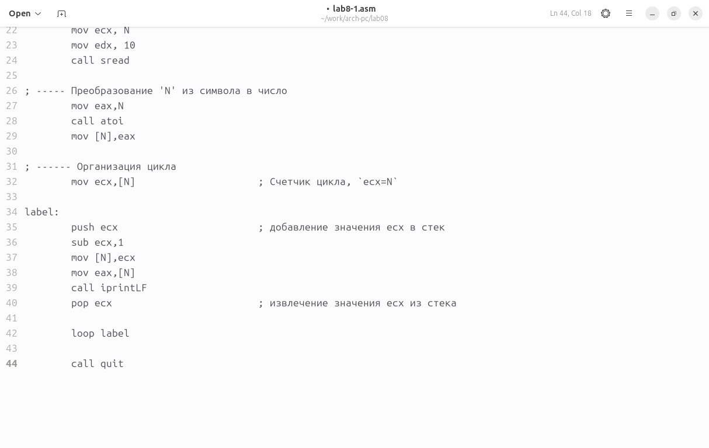{#fig:006 width=80%}

Создаю исполняемый файл и проверяю его работу. Теперь программа работает корректно (рис. [-@fig:007]).

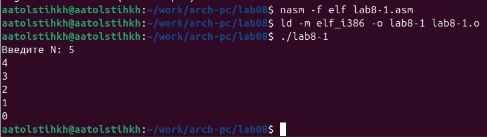{#fig:007 width=70%}

## Обработка аргументов командной строки

Создаю файл lab8-2.asm в каталоге ~/work/arch-pc/lab08 (рис. [-@fig:008]).

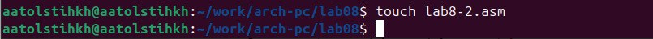{#fig:008 width=70%}

Ввожу в него текст программы из листинга 8.2 (рис. [-@fig:009]).

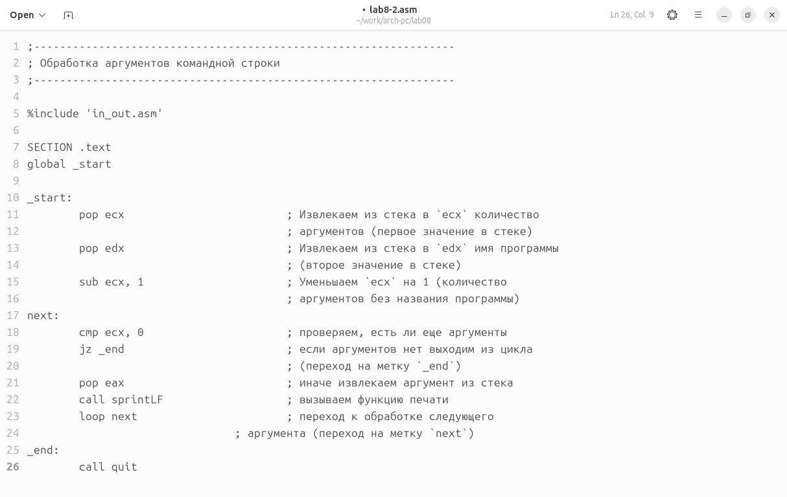{#fig:009 width=80%}

Создаю исполняемый файл и запускаю его, указывая данные аргументы. Программа обрабатывает 4 аргумента - "аргумент1", "аргумент", "2", "аргумент 3" (рис. [-@fig:010]).

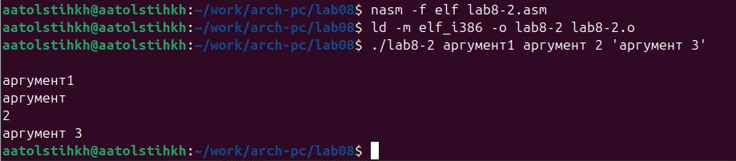{#fig:010 width=70%}

Создаю файл lab8-3.asm в каталоге ~/work/arch-pc/lab08 (рис. [-@fig:011]).

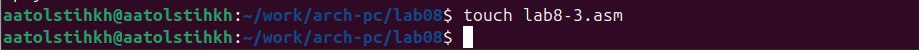{#fig:011 width=70%}

Ввожу в него текст программы из листинга 8.3 (рис. [-@fig:012]).

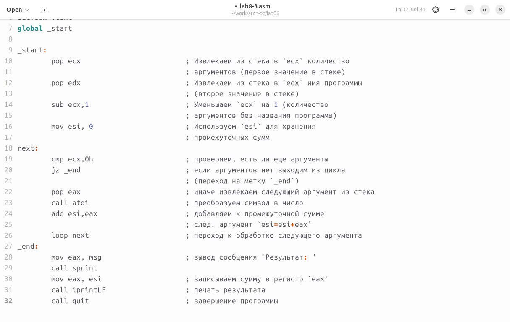{#fig:012 width=80%}

Создаю исполняемый файл и запускаю его, указывая некоторые числа как аргументы. Программа их обрабатывает и выводит их сумму (рис. [-@fig:013]).

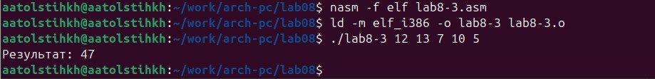{#fig:013 width=70%}

Изменяю текст программы из листинга 8.3 для вычисления произведения аргументов командной строки (рис. [-@fig:014]).

{#fig:014 width=80%}

Создаю исполняемый файл и запускаю его, указывая некоторые числа как аргументы. Программа их обрабатывает и выводит их произведение (рис. [-@fig:015]).

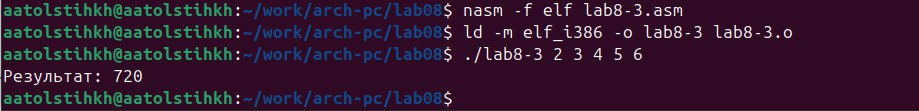{#fig:015 width=70%}

## Задание для самостоятельной работы

Создаю файл lab8-4.asm в каталоге ~/work/arch-pc/lab08 (рис. [-@fig:016]).

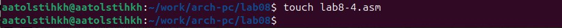{#fig:016 width=70%}

Создаю программу, которая находит сумму значений функции f(x)=30x-11 (16 вариант) для некоторых точек, заданных как аргументы (рис. [-@fig:017]).

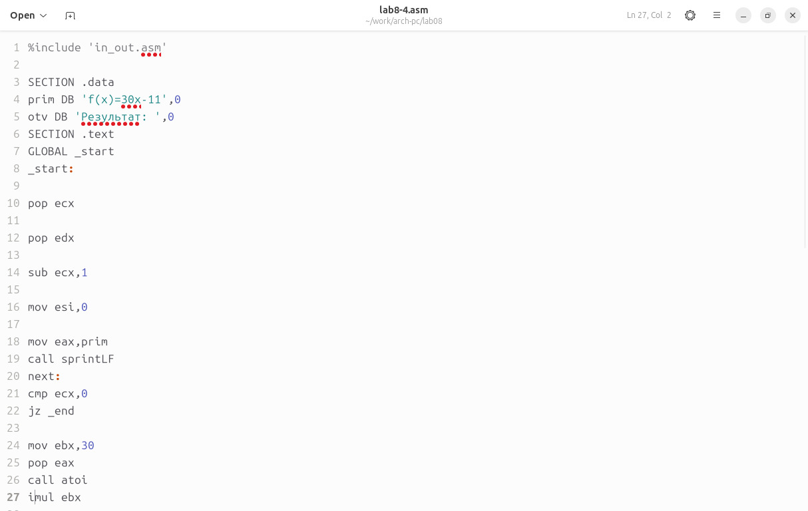{#fig:017 width=80%}

Создаю исполняемый файл и проверяю его работу на нескольких наборах чисел (рис. [-@fig:018]).

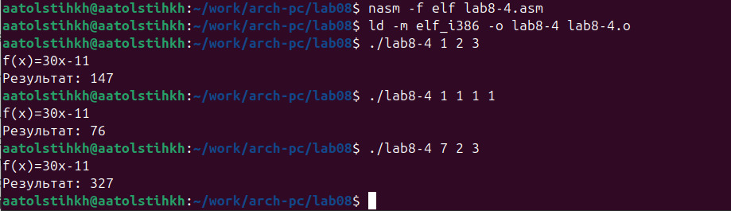{#fig:018 width=70%}

# Выводы

В результате выполнения лабораторной работы я приобрела навыки написания программ с использованием циклов и обработкой аргументов командной строки.
