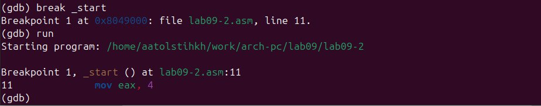
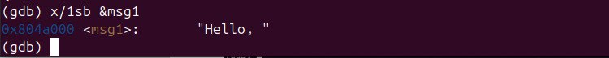
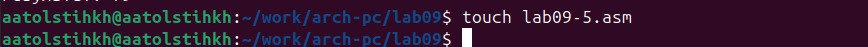
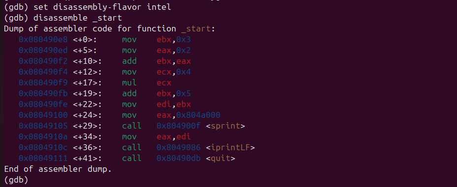

---
## Front matter
title: "Отчёт по лабораторной работе №9"
subtitle: "Дисциплина: Архитектура компьютера"
author: "Толстых Александра Андреевна"

## Generic otions
lang: ru-RU
toc-title: "Содержание"

## Bibliography
bibliography: bib/cite.bib
csl: pandoc/csl/gost-r-7-0-5-2008-numeric.csl

## Pdf output format
toc: true # Table of contents
toc-depth: 2
lof: true # List of figures
fontsize: 12pt
linestretch: 1.5
papersize: a4
documentclass: scrreprt
## I18n polyglossia
polyglossia-lang:
  name: russian
  options:
	- spelling=modern
	- babelshorthands=true
polyglossia-otherlangs:
  name: english
## I18n babel
babel-lang: russian
babel-otherlangs: english
## Fonts
mainfont: IBM Plex Serif
romanfont: IBM Plex Serif
sansfont: IBM Plex Sans
monofont: IBM Plex Mono
mathfont: STIX Two Math
mainfontoptions: Ligatures=Common,Ligatures=TeX,Scale=0.94
romanfontoptions: Ligatures=Common,Ligatures=TeX,Scale=0.94
sansfontoptions: Ligatures=Common,Ligatures=TeX,Scale=MatchLowercase,Scale=0.94
monofontoptions: Scale=MatchLowercase,Scale=0.94,FakeStretch=0.9
mathfontoptions:
## Biblatex
biblatex: true
biblio-style: "gost-numeric"
biblatexoptions:
  - parentracker=true
  - backend=biber
  - hyperref=auto
  - language=auto
  - autolang=other*
  - citestyle=gost-numeric
## Pandoc-crossref LaTeX customization
figureTitle: "Рис."
tableTitle: "Таблица"
listingTitle: "Листинг"
lofTitle: "Список иллюстраций"
lolTitle: "Листинги"
## Misc options
indent: true
header-includes:
  - \usepackage{indentfirst}
  - \usepackage{float} # keep figures where there are in the text
  - \floatplacement{figure}{H} # keep figures where there are in the text
---

# Цель работы

Приобретение навыков написания программ с использованием подпрограмм. Знакомство с методами отладки при помощи GDB и его основными возможностями.

# Задание

1. Реализация подпрограмм в NASM.
2. Отладка программам с помощью GDB.
3. Задание для самостоятельной работы.

# Выполнение лабораторной работы

## Реализация подпрограмм в NASM

Создаю каталог для выполнения лабораторной работы № 9, перехожу в него и создю файл lab09-1.asm (рис. [-@fig:001]).

{#fig:001 width=70%}

Ввожу в файл lab09-1.asm текст программы из листинга 9.1 (рис. [-@fig:002]).

{#fig:002 width=70%}

Создаю исполняемый файл и проверяю его работу (рис. [-@fig:003]).

{#fig:003 width=70%}

Изменяю текст программы, добавив подпрограмму _subcalcul в подпрограмму _calcul, для вычисления выражения f(g(x)), где x вводится с клавиатуры, f(x) = 2x + 7, g(x) = 3x − 1 (рис. [-@fig:004]).

{#fig:004 width=70%}

Создаю исполняемый файл и проверяю его работу (рис. [-@fig:005]).

{#fig:005 width=70%}

## Отладка программам с помощью GDB

Создаю файл lab09-2.asm (рис. [-@fig:006]).

{#fig:006 width=70%}

Ввожу в него текст из программы из Листинга 9.2 (рис. [-@fig:007]).

{#fig:007 width=70%}

Получаю исполняемый файл. Для работы с GDB в исполняемый файл необходимо добавить отладочную информацию, для этого трансляцию программ необходимо проводить с ключом ‘-g’. Загружаю исполняемый файл в отладчик gdb (рис. [-@fig:008]).

{#fig:008 width=70%}

Проверяю работу программы, запустив ее в оболочке GDB с помощью команды run (рис. [-@fig:009]).

{#fig:009 width=70%}

Для более подробного анализа программы устанавливаю брейкпоинт на метку _start, с которой начинается выполнение любой ассемблерной программы, и запускаю её (рис. [-@fig:010]).

{#fig:010 width=70%}

Смотрю дисассимилированный код программы с помощью команды disassemble начиная с метки _start (рис. [-@fig:011]).

{#fig:011 width=70%}

Переключаюсь на отображение команд с Intel’овским синтаксисом, введя команду set disassembly-flavor intel (рис. [-@fig:012]). Отличие заключается в командах, в диссамилированном отображении в командах используют % и $, а в Intel отображение эти символы не используются. На такое отображение удобнее смотреть.

{#fig:012 width=70%}

Включаю режим псевдографики для более удобного анализа программы (рис. [-@fig:013]).

{#fig:013 width=70%}

На предыдущих шагах была установлена точка останова по имени метки (_start). Проверяю это с помощью команды info breakpoints (рис. [-@fig:014]).

{#fig:014 width=70%}

Устанавливаю еще одну точку останова по адресу предпоследней инструкции (mov ebx,0x0) и снова смотрю информацию о всех установленных точках останова (рис. [-@fig:015]).

{#fig:015 width=70%}

Выполняю 5 инструкций с помощью команды stepi (или si). Изменяются регистры ebx, ecx, edx, eax (рис. [-@fig:016]).

{#fig:016 width=150%}

Смотрю значение переменной msg1 по имени (рис. [-@fig:017]).

{#fig:017 width=70%}

Смотрю значение переменной msg2 по адресу (рис. [-@fig:018]).

{#fig:018 width=70%}

Изменяю первый символ переменной msg1 (рис. [-@fig:019]).

{#fig:019 width=70%}

Изменяю символ во второй переменной msg2 (рис. [-@fig:020]).

{#fig:020 width=70%}

Вывожу в различных форматах значение регистра edx (рис. [-@fig:021]).

{#fig:021 width=70%}

С помощью команды set изменяю значение регистра ebx (рис. [-@fig:022]). Команда выводит два разных значения, так как в первый раз мы вносим значение 2, а во второй раз регистр равен двум.

{#fig:022 width=70%}

Завершаю выполнение программы с помощью команды continue (сокращенно c) и выхожу из GDB с помощью команды quit (сокращенно q) (рис. [-@fig:023]).

{#fig:023 width=70%}

Копирую файл lab8-2.asm, созданный при выполнении лабораторной работы №8, с программой выводящей на экран аргументы командной строки (Листинг 8.2) в файл с именем lab09-3.asm (рис. [-@fig:024]).

{#fig:024 width=70%}

Создаю исполняемый файл (рис. [-@fig:025]).

{#fig:025 width=70%}

Для загрузки в gdb программы с аргументами необходимо использовать ключ --args. Загружаю исполняемый файл в отладчик, указав аргументы (рис. [-@fig:026]).

{#fig:026 width=70%}

Устанавливаю точку останова перед первой инструкцией в программе и запускаю ее (рис. [-@fig:027]).

{#fig:027 width=70%}

Адрес вершины стека храниться в регистре esp и по этому адресу располагается число равное количеству аргументов командной строки (включая имя программы). Убеждаюсь, что там число 5 (рис. [-@fig:028]).

{#fig:028 width=70%}

Смотрю все позиции стека (рис. [-@fig:029]). По первому адресу хранится адрес, в остальных адресах хранятся элементы. Элементы расположены с интервалом в 4 единицы, так как стек может хранить до 4 байт, и для того чтобы данные сохранялись нормально и без помех, компьютер использует новый стек для новой информации. 

{#fig:029 width=70%}

## Задание для самостоятельной работы

Копирую файл из предыдущей лабораторной (рис. [-@fig:030]).

{#fig:030 width=70%}

Преобразую программу, реализовав вычисление значения функции f(x) как подпрограмму (рис. [-@fig:031]).

{#fig:031 width=70%}

Создаю исполняемый файл и проверяю его работу (рис. [-@fig:032]).

{#fig:032 width=70%}

Создаю новый файл для дальнейшей работы с программой из листинга 9.3 (рис. [-@fig:033]).

{#fig:033 width=70%}

Ввожу в него текст программы (рис. [-@fig:034]).

{#fig:034 width=70%}

Получаю исполняемый файл. Для работы с GDB в исполняемый файл необходимо добавить отладочную информацию, для этого трансляцию программ необходимо проводить с ключом '-g'. Загружаю исполняемый файл в отладчик gdb и запускаю программу при помощи команды 'r' (рис. [-@fig:035]).

{#fig:035 width=70%}

Результат программы неправильный, поэтому настраиваю отображение команд для дальнейшего изучения (рис. [-@fig:036]).

{#fig:036 width=70%}

Для более подробного анализа программы устанавливаю брейкпоинт на метку _start, с которой начинается выполнение любой ассемблерной программы, и запускаю её (рис. [-@fig:037]).

{#fig:037 width=70%}

Анализируя регистры, замечаю, что некоторые стоят не на своих местах (рис. [-@fig:038]).

{#fig:038 width=70%}

Открываю программу и изменяю места регистров на правильные (рис. [-@fig:039]).

{#fig:039 width=70%}

После нахождения ошибки и изменения программы заново создаю исполняемый файл и запускаю его (рис. [-@fig:040]). Теперь программа работает корректно.

{#fig:040 width=70%}

# Выводы

В ходе выполнения лабораторной работы я приобрела навыки написания программ с использованием подпрограмм.А также познакомилась с методами отладки при помощи GDB и его основными возможностями.
