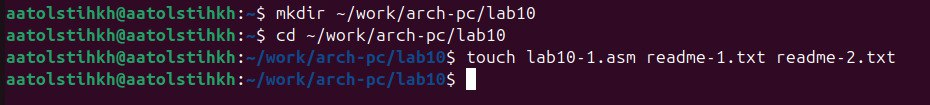
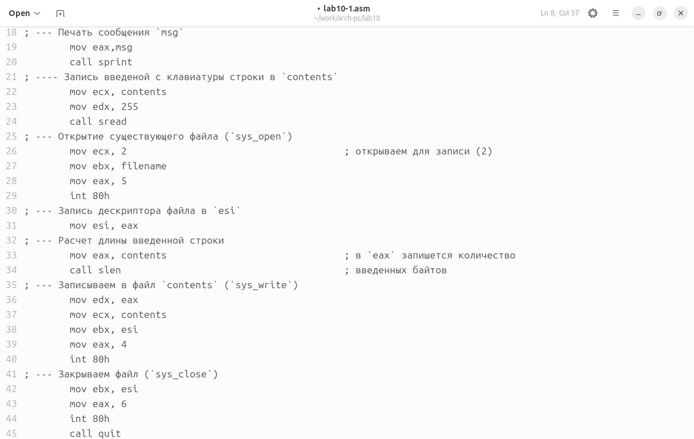
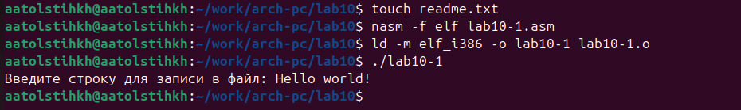
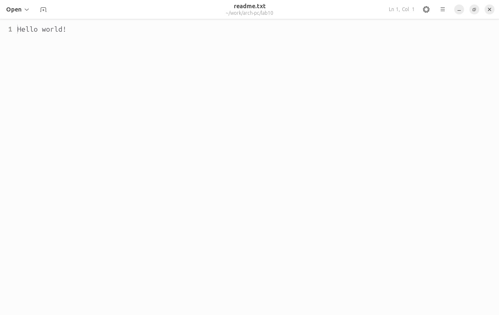
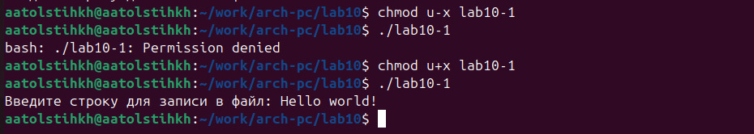
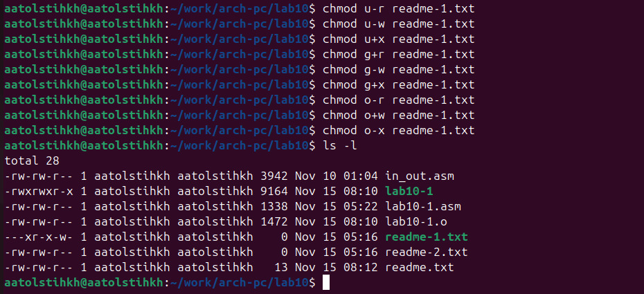
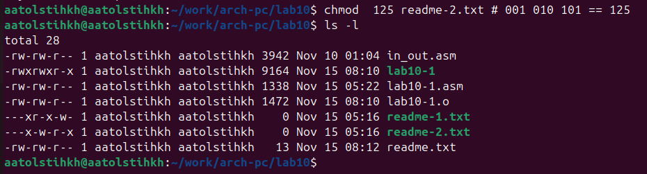
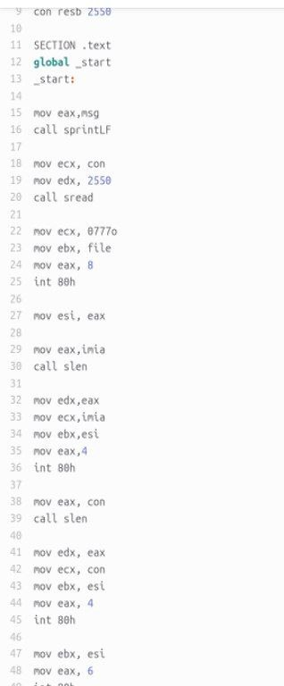
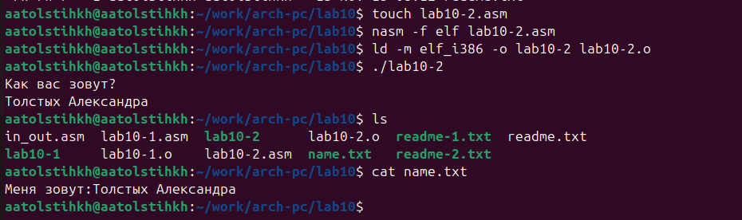

---
## Front matter
title: "Отчёт по лабораторной работе №10"
subtitle: "Дисциплина: Архитектура компьютера"
author: "Толстых Александра Андреевна"

## Generic otions
lang: ru-RU
toc-title: "Содержание"

## Bibliography
bibliography: bib/cite.bib
csl: pandoc/csl/gost-r-7-0-5-2008-numeric.csl

## Pdf output format
toc: true # Table of contents
toc-depth: 2
lof: true # List of figures
fontsize: 12pt
linestretch: 1.5
papersize: a4
documentclass: scrreprt
## I18n polyglossia
polyglossia-lang:
  name: russian
  options:
	- spelling=modern
	- babelshorthands=true
polyglossia-otherlangs:
  name: english
## I18n babel
babel-lang: russian
babel-otherlangs: english
## Fonts
mainfont: IBM Plex Serif
romanfont: IBM Plex Serif
sansfont: IBM Plex Sans
monofont: IBM Plex Mono
mathfont: STIX Two Math
mainfontoptions: Ligatures=Common,Ligatures=TeX,Scale=0.94
romanfontoptions: Ligatures=Common,Ligatures=TeX,Scale=0.94
sansfontoptions: Ligatures=Common,Ligatures=TeX,Scale=MatchLowercase,Scale=0.94
monofontoptions: Scale=MatchLowercase,Scale=0.94,FakeStretch=0.9
mathfontoptions:
## Biblatex
biblatex: true
biblio-style: "gost-numeric"
biblatexoptions:
  - parentracker=true
  - backend=biber
  - hyperref=auto
  - language=auto
  - autolang=other*
  - citestyle=gost-numeric
## Pandoc-crossref LaTeX customization
figureTitle: "Рис."
tableTitle: "Таблица"
listingTitle: "Листинг"
lofTitle: "Список иллюстраций"
lolTitle: "Листинги"
## Misc options
indent: true
header-includes:
  - \usepackage{indentfirst}
  - \usepackage{float} # keep figures where there are in the text
  - \floatplacement{figure}{H} # keep figures where there are in the text
---

# Цель работы

Приобретение навыков написания программ для работы с файлами.

# Задание

1. Выполнение лабораторной работы
2. Выполнение задания для самостоятельной работы

# Выполнение лабораторной работы

## Выполнение лабораторной работы

Создаю каталог для программ лабораторной работы № 10, перехожу в него и создаю файлы lab10-1.asm, readme-1.txt и readme-2.txt (рис. [-@fig:001]).

{#fig:001 width=70%}

Ввожу в файл lab10-1.asm текст программы из листинга 10.1 (рис. [-@fig:002]).

{#fig:002 width=70%}

Создаю исполняемый файл и проверяю его работу (рис. [-@fig:003]).

{#fig:003 width=70%}

Открываю файл readme.txt и проверяю что все работает корректно (рис. [-@fig:004]).

{#fig:004 width=70%}

С помощью команды chmod изменяю права доступа к исполняемому файлу lab10-1, запретив его выполнение. Пытаюсь выполнить файл. Выдается отказ, поскольку командой мы запретили себе доступ к нему. С помощью команды chmod разрешаю выполнение файла и запускаю его еще раз. После того, как мы открыли доступ - все работает (рис. [-@fig:005]).

{#fig:005 width=70%}

В соответствии с заданием 16 варианта предоставляю права доступа к файлу readme-1.txt представленные в символьном виде и проверяю правильность выполнения с помощью команды ls -l (рис. [-@fig:006]).

{#fig:006 width=70%}

А также предоставляю доступ для файла readme-2.txt в двочном виде и проверяю правильность выполнения с помощью команды ls -l (рис. [-@fig:007]).

{#fig:007 width=70%}

## Выполнение самостоятельной работы

Пишу программу по указанным требованиям (вывод приглашения “Как Вас зовут?”, ввести с клавиатуры свои фамилию и имя, создать файл с именем name.txt, записать в файл сообщение “Меня зовут”, дописать в файл строку введенную с клавиатуры, закрыть файл) (рис. [-@fig:008]).

{#fig:008 width=110%}

Создаю исполняемый файл и проверяю его работу. Проверяю также наличие файла и его содержимое с помощью команд ls и cat (рис. [-@fig:009]).

{#fig:009 width=70%}

# Выводы

В ходе выполнения работы я приобрела навыки написания программ для работы с файлами.
